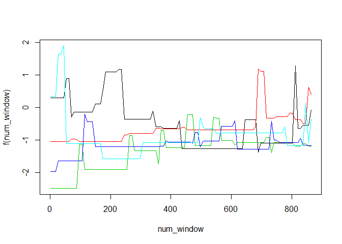

This is a assignment project on human activity recognition for Practical Machine learning course on Coursera. \#\#Introduction Activity monitoring devices like fitbit or jawbone up are now capable of collecting huge amount of information with least of expenses. This collected activity data can be quantified and converted to easy to understand data formats where we can analyse and interpret our activities. Such data was collected by 6 fitness enthusiastics and was made available at <http://groupware.les.inf.puc-rio.br/har> .

The datasets are available on the below links. The training data for this project are available here:

<https://d396qusza40orc.cloudfront.net/predmachlearn/pml-training.csv>

The test data are available here:

<https://d396qusza40orc.cloudfront.net/predmachlearn/pml-testing.csv>

The goal of this work is to use machine learning methods to predict the way the participants did their eercise. We will be using the accelerometer data available to predict the values.

Load the required libraries and datasets
----------------------------------------

``` r
library(caret); set.seed(3123)
```

    ## Loading required package: lattice

    ## Loading required package: ggplot2

``` r
training <- read.csv("pml-training.csv", header = TRUE, na.strings = c("NA",""))
testing <- read.csv("pml-testing.csv", header = TRUE,na.strings = c("NA",""))
```

Data cleaning and selection
---------------------------

The dataset has a huge number of colums and there are many fields that are empty. We need to clean the data and use only the information that is required for the prediction model.

### Removing the empty columns

``` r
nacols <- colSums(is.na(training))
#remove the colums with NA values in all rows 
train2 <- training[,colSums(is.na(training)) ==0]
test2 <- testing[,colSums(is.na(training)) ==0]
```

### Removing the unnecessary columns

``` r
#remove unnecessary columns like x, name and timestamp.
train3 <- train2[, -grep("X|user_name|timestamp|new_window", colnames(train2))]
test3 <- test2[, -grep("X|user_name|timestamp|new_window", colnames(train2))]
```

For the above data train3, we will create datasets that will be used to train and test the model that we can creating. For this purpose, we will use 70% of data for training and 30% for testing.

``` r
#create data partition to train and test 
traind <- createDataPartition(train3$classe,p=0.7,list=FALSE)
trainf <- train3[traind,]
testf <- train3[-traind,]
dim(trainf); dim(testf)
```

    ## [1] 13737    54

    ## [1] 5885   54

Model1: Random Forest
---------------------

We will be using randomforest to create the model as below.

``` r
#create the model fit  RF
control_rf <- trainControl(method="oob",number=10,repeats=5,p=0.80)
fit_rf <- train(classe~.,data=trainf,trControl=control_rf)
```

    ## Loading required package: randomForest

    ## randomForest 4.6-12

    ## Type rfNews() to see new features/changes/bug fixes.

    ## 
    ## Attaching package: 'randomForest'

    ## The following object is masked from 'package:ggplot2':
    ## 
    ##     margin

``` r
#plot final model for error curve 
plot(fit_rf$finalModel)
```

<!-- -->

Lets see the performace of the model on train and test data.

``` r
#performance of model on training data
predict_trainf <- predict(fit_rf,trainf)
```

    ## Loading required package: randomForest

    ## randomForest 4.6-12

    ## Type rfNews() to see new features/changes/bug fixes.

    ## 
    ## Attaching package: 'randomForest'

    ## The following object is masked from 'package:ggplot2':
    ## 
    ##     margin

``` r
confusionMatrix(predict_trainf,trainf$classe)
```

    ## Confusion Matrix and Statistics
    ## 
    ##           Reference
    ## Prediction    A    B    C    D    E
    ##          A 3906    0    0    0    0
    ##          B    0 2658    0    0    0
    ##          C    0    0 2396    0    0
    ##          D    0    0    0 2252    0
    ##          E    0    0    0    0 2525
    ## 
    ## Overall Statistics
    ##                                      
    ##                Accuracy : 1          
    ##                  95% CI : (0.9997, 1)
    ##     No Information Rate : 0.2843     
    ##     P-Value [Acc > NIR] : < 2.2e-16  
    ##                                      
    ##                   Kappa : 1          
    ##  Mcnemar's Test P-Value : NA         
    ## 
    ## Statistics by Class:
    ## 
    ##                      Class: A Class: B Class: C Class: D Class: E
    ## Sensitivity            1.0000   1.0000   1.0000   1.0000   1.0000
    ## Specificity            1.0000   1.0000   1.0000   1.0000   1.0000
    ## Pos Pred Value         1.0000   1.0000   1.0000   1.0000   1.0000
    ## Neg Pred Value         1.0000   1.0000   1.0000   1.0000   1.0000
    ## Prevalence             0.2843   0.1935   0.1744   0.1639   0.1838
    ## Detection Rate         0.2843   0.1935   0.1744   0.1639   0.1838
    ## Detection Prevalence   0.2843   0.1935   0.1744   0.1639   0.1838
    ## Balanced Accuracy      1.0000   1.0000   1.0000   1.0000   1.0000

We can see the accuracy of the model on the training data on which it is build is 1. Now lets see its performance with testing data.

``` r
#performance of model on testing data
predict_testf <- predict(fit_rf,testf)
confusionMatrix(predict_testf,testf$classe)
```

    ## Confusion Matrix and Statistics
    ## 
    ##           Reference
    ## Prediction    A    B    C    D    E
    ##          A 1673    2    0    0    0
    ##          B    0 1136    4    0    0
    ##          C    0    1 1022    3    0
    ##          D    0    0    0  960    2
    ##          E    1    0    0    1 1080
    ## 
    ## Overall Statistics
    ##                                          
    ##                Accuracy : 0.9976         
    ##                  95% CI : (0.996, 0.9987)
    ##     No Information Rate : 0.2845         
    ##     P-Value [Acc > NIR] : < 2.2e-16      
    ##                                          
    ##                   Kappa : 0.997          
    ##  Mcnemar's Test P-Value : NA             
    ## 
    ## Statistics by Class:
    ## 
    ##                      Class: A Class: B Class: C Class: D Class: E
    ## Sensitivity            0.9994   0.9974   0.9961   0.9959   0.9982
    ## Specificity            0.9995   0.9992   0.9992   0.9996   0.9996
    ## Pos Pred Value         0.9988   0.9965   0.9961   0.9979   0.9982
    ## Neg Pred Value         0.9998   0.9994   0.9992   0.9992   0.9996
    ## Prevalence             0.2845   0.1935   0.1743   0.1638   0.1839
    ## Detection Rate         0.2843   0.1930   0.1737   0.1631   0.1835
    ## Detection Prevalence   0.2846   0.1937   0.1743   0.1635   0.1839
    ## Balanced Accuracy      0.9995   0.9983   0.9976   0.9977   0.9989

Observe, that the accuracy has slightly decreased.

Lets predict the for the actual data set, for which we were supposed to predict.

``` r
#actual testing dataset
predict20 <-predict(fit_rf, test3)
test_20_predict <- data.frame(predict20)
test_20_predict
```

    ##    predict20
    ## 1          B
    ## 2          A
    ## 3          B
    ## 4          A
    ## 5          A
    ## 6          E
    ## 7          D
    ## 8          B
    ## 9          A
    ## 10         A
    ## 11         B
    ## 12         C
    ## 13         B
    ## 14         A
    ## 15         E
    ## 16         E
    ## 17         A
    ## 18         B
    ## 19         B
    ## 20         B

Model2: GBM
-----------

We will also be validating the model with a boosting method, and cross verify how these two models work.

``` r
#gbm model 
# cross validate with GBM
control_gbm <- trainControl(method="cv",number=3, allowParallel=TRUE, verbose=TRUE)
fit_gbm <- train(classe~., data=trainf, method="gbm",trControl=control_gbm, verbose=FALSE)
```

    ## Loading required package: gbm

    ## Loading required package: survival

    ## 
    ## Attaching package: 'survival'

    ## The following object is masked from 'package:caret':
    ## 
    ##     cluster

    ## Loading required package: splines

    ## Loading required package: parallel

    ## Loaded gbm 2.1.1

    ## Loading required package: plyr

    ## + Fold1: shrinkage=0.1, interaction.depth=1, n.minobsinnode=10, n.trees=150 
    ## - Fold1: shrinkage=0.1, interaction.depth=1, n.minobsinnode=10, n.trees=150 
    ## + Fold1: shrinkage=0.1, interaction.depth=2, n.minobsinnode=10, n.trees=150 
    ## - Fold1: shrinkage=0.1, interaction.depth=2, n.minobsinnode=10, n.trees=150 
    ## + Fold1: shrinkage=0.1, interaction.depth=3, n.minobsinnode=10, n.trees=150 
    ## - Fold1: shrinkage=0.1, interaction.depth=3, n.minobsinnode=10, n.trees=150 
    ## + Fold2: shrinkage=0.1, interaction.depth=1, n.minobsinnode=10, n.trees=150 
    ## - Fold2: shrinkage=0.1, interaction.depth=1, n.minobsinnode=10, n.trees=150 
    ## + Fold2: shrinkage=0.1, interaction.depth=2, n.minobsinnode=10, n.trees=150 
    ## - Fold2: shrinkage=0.1, interaction.depth=2, n.minobsinnode=10, n.trees=150 
    ## + Fold2: shrinkage=0.1, interaction.depth=3, n.minobsinnode=10, n.trees=150 
    ## - Fold2: shrinkage=0.1, interaction.depth=3, n.minobsinnode=10, n.trees=150 
    ## + Fold3: shrinkage=0.1, interaction.depth=1, n.minobsinnode=10, n.trees=150 
    ## - Fold3: shrinkage=0.1, interaction.depth=1, n.minobsinnode=10, n.trees=150 
    ## + Fold3: shrinkage=0.1, interaction.depth=2, n.minobsinnode=10, n.trees=150 
    ## - Fold3: shrinkage=0.1, interaction.depth=2, n.minobsinnode=10, n.trees=150 
    ## + Fold3: shrinkage=0.1, interaction.depth=3, n.minobsinnode=10, n.trees=150 
    ## - Fold3: shrinkage=0.1, interaction.depth=3, n.minobsinnode=10, n.trees=150 
    ## Aggregating results
    ## Selecting tuning parameters
    ## Fitting n.trees = 150, interaction.depth = 3, shrinkage = 0.1, n.minobsinnode = 10 on full training set

``` r
fit_gbm
```

    ## Stochastic Gradient Boosting 
    ## 
    ## 13737 samples
    ##    53 predictor
    ##     5 classes: 'A', 'B', 'C', 'D', 'E' 
    ## 
    ## No pre-processing
    ## Resampling: Cross-Validated (3 fold) 
    ## Summary of sample sizes: 9157, 9159, 9158 
    ## Resampling results across tuning parameters:
    ## 
    ##   interaction.depth  n.trees  Accuracy   Kappa      Accuracy SD 
    ##   1                   50      0.7647942  0.7017103  0.0112252751
    ##   1                  100      0.8338055  0.7895922  0.0083958238
    ##   1                  150      0.8747903  0.8415555  0.0031149015
    ##   2                   50      0.8840351  0.8532397  0.0061340399
    ##   2                  100      0.9381230  0.9217123  0.0047032217
    ##   2                  150      0.9619276  0.9518360  0.0006304896
    ##   3                   50      0.9332457  0.9155222  0.0024065994
    ##   3                  100      0.9703720  0.9625136  0.0003315074
    ##   3                  150      0.9854406  0.9815810  0.0014071269
    ##   Kappa SD    
    ##   0.0142489864
    ##   0.0105346707
    ##   0.0039064938
    ##   0.0077354529
    ##   0.0059408140
    ##   0.0007929712
    ##   0.0030042698
    ##   0.0004166482
    ##   0.0017811224
    ## 
    ## Tuning parameter 'shrinkage' was held constant at a value of 0.1
    ## 
    ## Tuning parameter 'n.minobsinnode' was held constant at a value of 10
    ## Accuracy was used to select the optimal model using  the largest value.
    ## The final values used for the model were n.trees = 150,
    ##  interaction.depth = 3, shrinkage = 0.1 and n.minobsinnode = 10.

``` r
plot(fit_gbm$finalModel)
```

<!-- -->

Lets see how the model perrforms for training data

``` r
predict_gbm_trainf <- predict(fit_gbm,trainf)
```

    ## Loading required package: gbm

    ## Loading required package: survival

    ## 
    ## Attaching package: 'survival'

    ## The following object is masked from 'package:caret':
    ## 
    ##     cluster

    ## Loading required package: splines

    ## Loading required package: parallel

    ## Loaded gbm 2.1.1

    ## Loading required package: plyr

``` r
confusionMatrix(predict_gbm_trainf, trainf$classe)
```

    ## Confusion Matrix and Statistics
    ## 
    ##           Reference
    ## Prediction    A    B    C    D    E
    ##          A 3902   22    0    3    0
    ##          B    4 2618    7    8    5
    ##          C    0   17 2380   12    3
    ##          D    0    1    8 2228    9
    ##          E    0    0    1    1 2508
    ## 
    ## Overall Statistics
    ##                                          
    ##                Accuracy : 0.9926         
    ##                  95% CI : (0.9911, 0.994)
    ##     No Information Rate : 0.2843         
    ##     P-Value [Acc > NIR] : < 2.2e-16      
    ##                                          
    ##                   Kappa : 0.9907         
    ##  Mcnemar's Test P-Value : NA             
    ## 
    ## Statistics by Class:
    ## 
    ##                      Class: A Class: B Class: C Class: D Class: E
    ## Sensitivity            0.9990   0.9850   0.9933   0.9893   0.9933
    ## Specificity            0.9975   0.9978   0.9972   0.9984   0.9998
    ## Pos Pred Value         0.9936   0.9909   0.9867   0.9920   0.9992
    ## Neg Pred Value         0.9996   0.9964   0.9986   0.9979   0.9985
    ## Prevalence             0.2843   0.1935   0.1744   0.1639   0.1838
    ## Detection Rate         0.2841   0.1906   0.1733   0.1622   0.1826
    ## Detection Prevalence   0.2859   0.1923   0.1756   0.1635   0.1827
    ## Balanced Accuracy      0.9982   0.9914   0.9953   0.9939   0.9965

And its performance on testing data

``` r
predict_gbm_test<- predict(fit_gbm, testf)
confusionMatrix(predict_gbm_test, testf$classe)
```

    ## Confusion Matrix and Statistics
    ## 
    ##           Reference
    ## Prediction    A    B    C    D    E
    ##          A 1669    9    0    0    0
    ##          B    5 1115   12    5    6
    ##          C    0   12 1006   11    4
    ##          D    0    3    8  948    6
    ##          E    0    0    0    0 1066
    ## 
    ## Overall Statistics
    ##                                           
    ##                Accuracy : 0.9862          
    ##                  95% CI : (0.9829, 0.9891)
    ##     No Information Rate : 0.2845          
    ##     P-Value [Acc > NIR] : < 2.2e-16       
    ##                                           
    ##                   Kappa : 0.9826          
    ##  Mcnemar's Test P-Value : NA              
    ## 
    ## Statistics by Class:
    ## 
    ##                      Class: A Class: B Class: C Class: D Class: E
    ## Sensitivity            0.9970   0.9789   0.9805   0.9834   0.9852
    ## Specificity            0.9979   0.9941   0.9944   0.9965   1.0000
    ## Pos Pred Value         0.9946   0.9755   0.9739   0.9824   1.0000
    ## Neg Pred Value         0.9988   0.9949   0.9959   0.9967   0.9967
    ## Prevalence             0.2845   0.1935   0.1743   0.1638   0.1839
    ## Detection Rate         0.2836   0.1895   0.1709   0.1611   0.1811
    ## Detection Prevalence   0.2851   0.1942   0.1755   0.1640   0.1811
    ## Balanced Accuracy      0.9974   0.9865   0.9875   0.9900   0.9926

Lets compare the output of both the models

``` r
confusionMatrix(predict_testf,predict_gbm_test)
```

    ## Confusion Matrix and Statistics
    ## 
    ##           Reference
    ## Prediction    A    B    C    D    E
    ##          A 1670    5    0    0    0
    ##          B    7 1117   12    4    0
    ##          C    0   10 1008    8    0
    ##          D    0    5    9  948    0
    ##          E    1    6    4    5 1066
    ## 
    ## Overall Statistics
    ##                                           
    ##                Accuracy : 0.9871          
    ##                  95% CI : (0.9839, 0.9898)
    ##     No Information Rate : 0.2851          
    ##     P-Value [Acc > NIR] : < 2.2e-16       
    ##                                           
    ##                   Kappa : 0.9837          
    ##  Mcnemar's Test P-Value : NA              
    ## 
    ## Statistics by Class:
    ## 
    ##                      Class: A Class: B Class: C Class: D Class: E
    ## Sensitivity            0.9952   0.9773   0.9758   0.9824   1.0000
    ## Specificity            0.9988   0.9951   0.9963   0.9972   0.9967
    ## Pos Pred Value         0.9970   0.9798   0.9825   0.9854   0.9852
    ## Neg Pred Value         0.9981   0.9945   0.9949   0.9965   1.0000
    ## Prevalence             0.2851   0.1942   0.1755   0.1640   0.1811
    ## Detection Rate         0.2838   0.1898   0.1713   0.1611   0.1811
    ## Detection Prevalence   0.2846   0.1937   0.1743   0.1635   0.1839
    ## Balanced Accuracy      0.9970   0.9862   0.9860   0.9898   0.9983

We can see although these two models are not exactly same however, 99% prediction is coming accurate.
